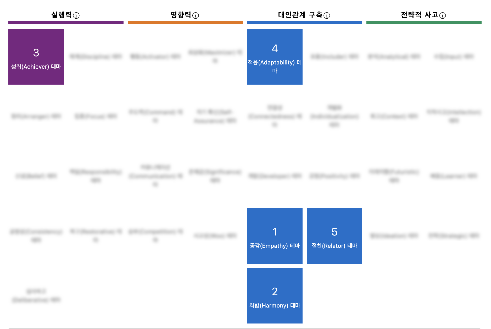
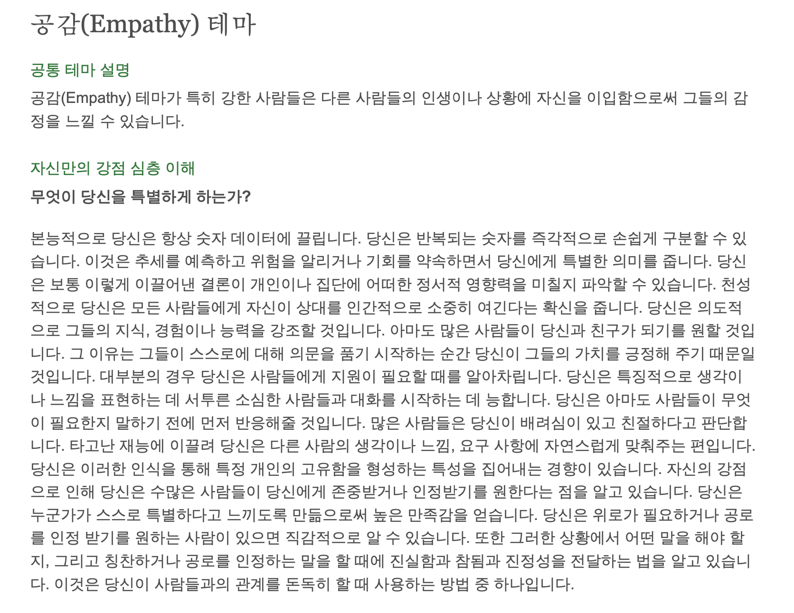
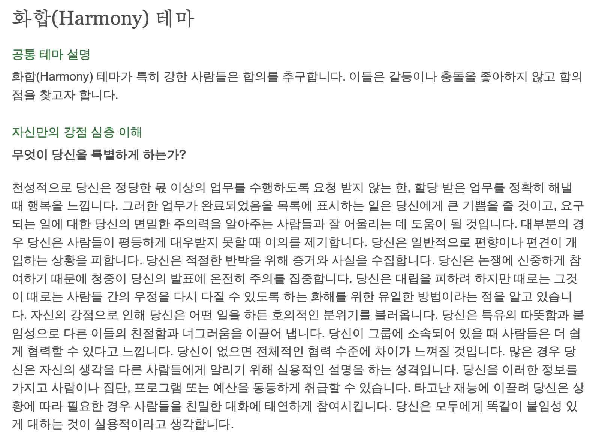
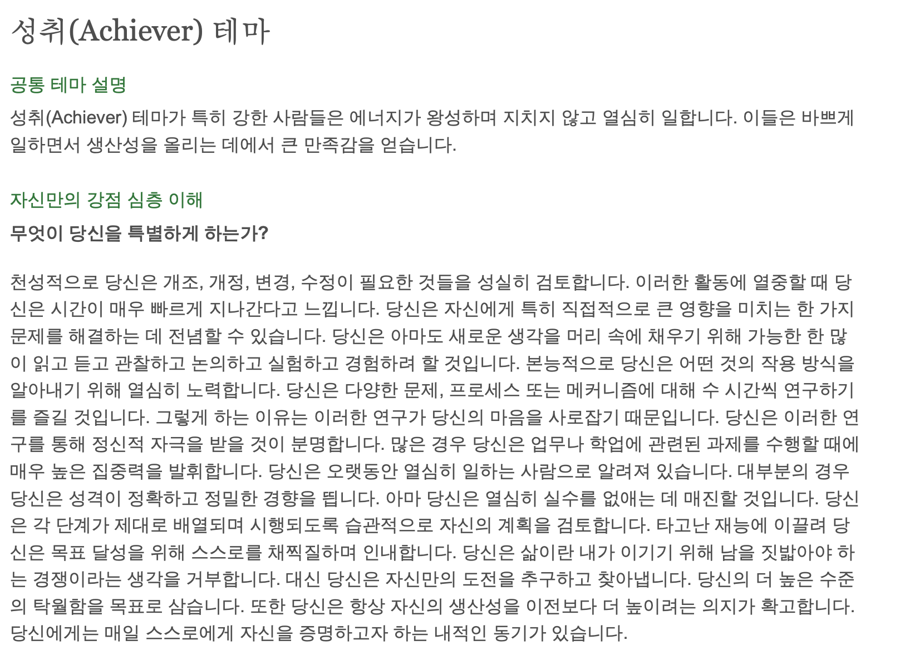
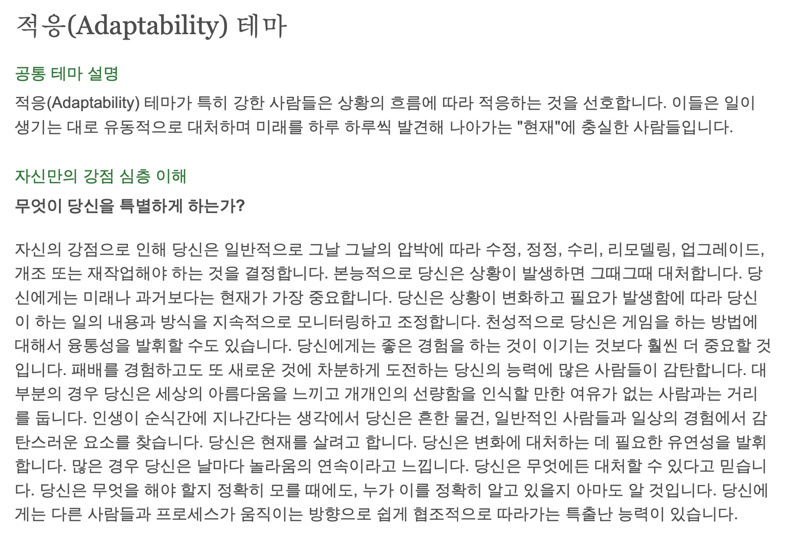
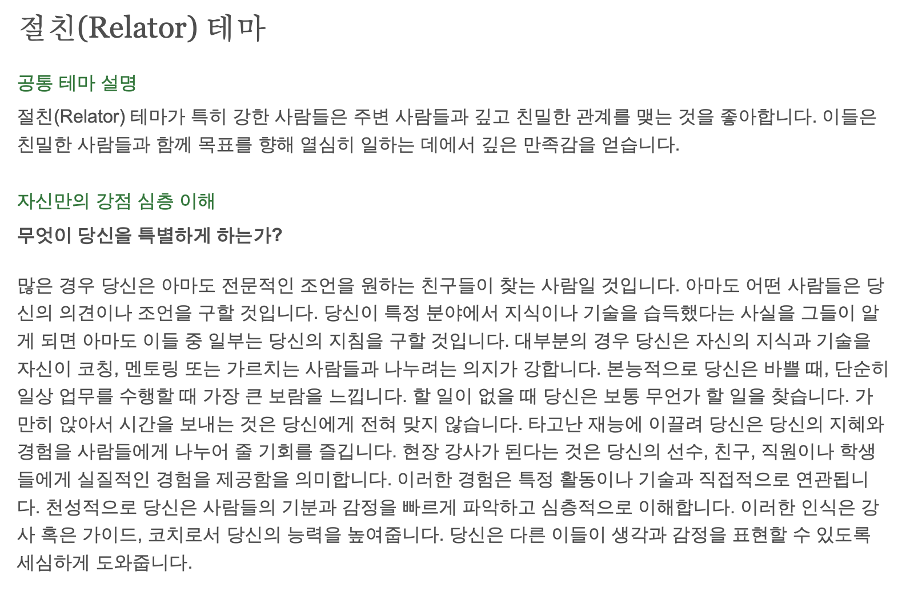

 
 
## 과제 1. 아래 질문에 대한 답변을 본인 블로그에 작성해봅니다.

### 1.자신의 강점 리포트를 처음 봤을 때 어떤 느낌이 들었습니까?
리포트를 읽으면서 느꼈던 것을 적어봤습니다.

#### 1. 공감

> 반복되는 숫자를 빠르고 쉽게 구분할 수 있다는 게 규칙성을 잘 찾는다는 의미겠죠? 근데 데이터분석가처럼 진짜 데이터들을 보고 추세를 예측한 적은 거의 없는 것 같고 사람들의 경향성을 보고 예측하는 것은 잘하는 것 같아요.
모든사람들을 소중히 여기려는 노력을 하는 거 같긴 합니다
남들의 장점을 찾아 칭찬하는 것을 좋아하는 것도 맞는 것 같아요
남들이 도움이 필요한 순간을 잘 캐치하는 것도 맞는 거 같고 표현을 잘 못하는 사람과 대화를 잘 주도하는 것도 맞는 거 같아요. 제 여자친구가 그런 편인데 제가 표현할 수 있도록 계속 유도하고 있거든요
그리고 사람들이 원하는 말, 원하는 행동을 잘 아는 것 같아요. 그래서 편지를 주면 항상 듣고싶은 말들이 들어있다고 많이 하는 것 같습니다
상대방이 듣고 싶은 말, 인정 받고 싶어할 때 인정해주는 행동으로 상대방에게 신뢰와 호감을 쌓는 방법을 제가 사용한다고 나와있는데 맞는 것 같아요

#### 2. 화합

> 할당받은 업무를 정확히 해낼 때 행복을 느낀다고 하는데 정확해요. 실제로 자소서에도 비슷한 내용을 쓴 적이 있어요! 
제가 하는 일에 대한 저의 주의력을 알아주는 사람들을 좋아하긴 합니다.
평등하게 대우받지 못할 때 이의를 제기한다고 했는데 사실 저는 가만히 있는 편인 것 같아요. 그냥 친한친구랑 뒤에서 소곤소곤할 것 같습니다.
그 이후의 내용은 정확하게 똑같습니다.. 확실한 증거와 자료가 없으면 반박을 하지 않는 편이에요. 제가 없으면 전체적인 협력 수준에 차이가 있을 거라고 했는데 실제로 비슷한 말을 들은 적이 있어요. 분위기가 안좋았던 팀에 “너가 있었으면 분위기가 좋았을 텐데..” 라는 말을 들었습니다. 상대방의 눈치를 상당히 많이 보기도 하고 팀의 분위기에 정말 신경을 많이쓰는 것 같습니다.

#### 3. 성취

> 개발하고 수정할 때 꼼꼼히 검토하려고 하고 한 번 집중하면 시간이 정말 빠르게 가요. 실제로 제가 2주차 옥토버 모임 때 “개발할 때 시간이 빨리간다고 느낀다” 라고 말했습니다!
그리고 여러가지 일보다 제가 가장 중요하다고 생각하는 한 가지 일에만 집중하는 것을 좋아하기도 합니다. 매커니즘 이해하는 것을 좋아하는 것 같아요. 개발할 때도 이 동작이 어떻게 이루어지는지 흐름을 타고 가는 것을 좋아합니다. 
실수를 없애는데에 매진한다고 했는데 정말 맞습니다. 실수를 정말 하지 않으려고 최선을 다합니다. 
와 그리고 이기기 위해 남을 짓밟아야 한다는 생각을 거부한다는 정말 맞아요. 저는 경쟁하는 것으 정말 싫어합니다. 즐길 수가 없잖아요..

#### 4. 적응

> 상황에 따라 그 때 그 때 대처한다는 거 정말 맞아요. 패배를 경험하고 새로운 것에 차분하게 도전한다고 하는데 음 실패해도 계속 정진한다는 말일까요? 새로운 것을 도전한다는 말이 잘 안와닿네요. 저는 새로운 것을 좋아하지 않습니다.
여유로운 사람을 좋아하는 건 맞습니다! 막 성급한 사람을 좋아하지 않아요. 어느정도 여유를 가지고 주변을 돌아보는 사람을 좋아해요
날마다 놀라움의 연속이라고 느끼는 건 아닌 것 같아요!

#### 5. 절친

> 가끔 조언을 구하러 옥니 하는데 많이 구하러 오는 것 같지는 않습니다. 
제가 가진 지식이나 노하우들을 공유하는 것을 좋아해요. 오.. 그리고 바쁘게 뭔가를 할 때를 좋아하는 게 맞아요. 아무 일도 없으면 사람이 좀 처지고 우울해지는 것 같아요.. 그래서 방학 때도 학기가 시작됐으면 좋겠다고 자주 생각했던 것 같습니다.
제가 사람들의 기분을 빠르게 파악하고 지식을 공유하려는 의지가 강해서 코치를 한다면 잘할 수 있다고 말해주는 것 같네요

 
 

##  2. 리포트 중 뜻 밖이라고 느낀 내용이 있습니까?
>[화합]
평등하게 대우받지 못할 때 이의를 제기한다고 했는데 사실 저는 가만히 있는 편인 것 같아요. 그냥 친한친구랑 뒤에서 소곤소곤할 것 같습니다.

>[적응]
패배를 경험하고 새로운 것에 차분하게 도전한다고 하는데 실패해도 계속 정진한다는 말일까요? 새로운 것을 도전한다는 말이 잘 안와닿네요. 저는 새로운 것을 좋아하지 않습니다.

 

## 3. [총 34개의 테마]중, 자신의 대표 테마 5개 중에 포함되리라 예상했으나 없었던 특정 테마가 있습니까?
회고가 나올 수도 있겠다는 생각을 했어요. 추억팔이같은 과거회상을 종종 하는 편이거든요
또 복구는 제가 자신있는 부분이라고 생각했어요. 저는 문제가 발생했을 때 무엇이 문제인지 파악하는 능력이 좀 있다고 생각해요
34가지 다 읽어봤는데 읽다가 “어! 이거 난데?” 하면 이미 5가지 강점에 포함돼있더라구요! 회고나 복구 아니면 저와는 거리가 먼 특성들인 것 같습니다.

## 4. 자신의 강점 리포트를 다른 사람에게 보여주었습니까? 반응은 어땠습니까?
한 명한테 보여줬었는데 뭐라고 했는지 기억이 잘 안나네요. 되게 사람 좋게 나왔다고 했던 것 같아요

## 5. 다섯 가지 상위 테마 중 이 테마가 나를 잘 표현한다고 생각하거나, 애정하는 테마가 있나요?
공감인 것 같아요. 되게 좋은 강점이라고 생각하고 이에 대해 느낀 바는 위에 썼으니 최근에 느낀 점에 대해 말해볼게요. 개개인에게 공감을 하기 위해서 저도 모르게 많은 에너지를 사용하는 것 같다고 요즘 느끼고 있어요. 제가 노력하지 않아도 알아서 모든 사람들을 관찰하고 있는 저의 모습을 자주 보게 됩니다. 그래서 밖에 오래 돌아다니면(사람들을 만나면) 기가빨리고 금방 피로해지는게 아닌가 싶네요. 친하고 편한 사람들과 있으면 같이 오래있어도 기가 잘 안빨리는데.. (이건 저만 그런 게 아닐 수도 있겠네요) 그래도 저의 가장 큰 강점이고 이 강점으로 인해 인관관계에서 많은 이득을 보는 것 같다는 생각이 들어 애정이 많이 갑니다.

## 6. 당신의 대표 테마(상위 5개) 중 이해하기 힘들거나 당신에게서 그러한 테마를 찾기 어려운 것이 있습니까? 만약 그렇다면, 테마의 정의 중 당신에게 적용되지 않는다고 생각되는 부분이 있습니까?
아니요! 다 이해됐고 저를 정말 잘 설명하는 강점들인 것 같아요.

## 2. 표를 그려 강점과 최근 경험을 작성해보자

